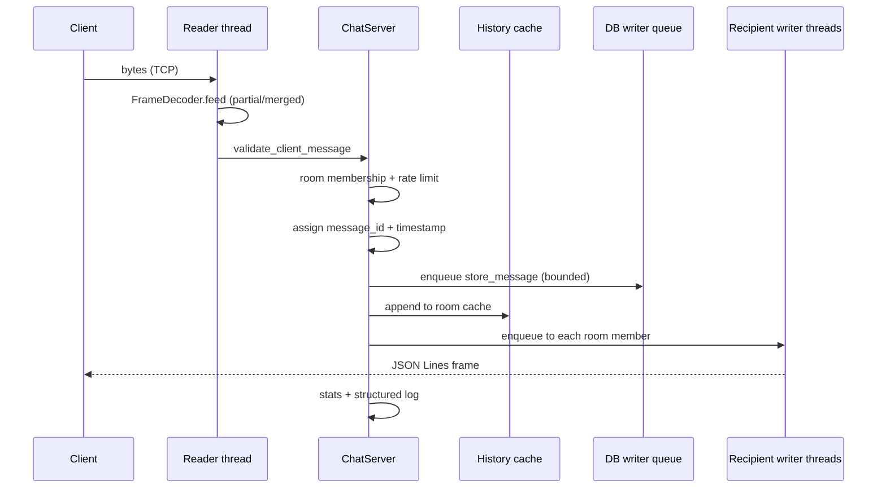

# Architecture

The package separates protocol, network I/O, routing, persistence, caching, scheduling, security, observability, CLI, and teaching examples.

## Lifecycle of one chat message



Production flow (text form):

```text
socket bytes
  -> FrameDecoder
  -> protocol validation
  -> session/server handler
  -> routing snapshot
  -> outbound queues
  -> writer threads

accepted message
  -> history cache append
  -> bounded DB job enqueue
  -> single SQLite writer thread
```

The CLI imports and calls the library. Core behavior lives in `chatserver.network.server.ChatServer`, not in command code.

An optional `AdminServer` (enabled with `--admin-port`) exposes a localhost
control socket that calls the same `ChatServer` API the CLI uses
(stats/clients/rooms/queues/cache/evictions/kick/broadcast), so admin tooling
adds no behavior of its own. It is bound to localhost and unauthenticated by
design.

## Deviations from the suggested layout

The scope sketches a finer module tree than this build ships, on purpose —
depth over breadth. Notable consolidations:

- `scheduling/heartbeat.py`, `idle_timeout.py`, `pruning.py` → a single
  `scheduling/scheduler.py` plus the jobs registered in `ChatServer.start()`.
- `routing/dispatcher.py`, `cache/presence_cache.py`, `cache/eviction.py`,
  `network/sockets.py`, `security/validation.py` → folded into `server.py`,
  `history_cache.py`, and the existing protocol/security modules.
- `cli/commands/{server,client,admin,demo}.py` are present; argument wiring
  lives in `cli/main.py`, behavior in the command modules.

`engines/` keeps the `ServerEngine` ABC and the `threaded` implementation; the
`selectors`/`asyncio` engines are documented stretch placeholders behind the
same interface.
