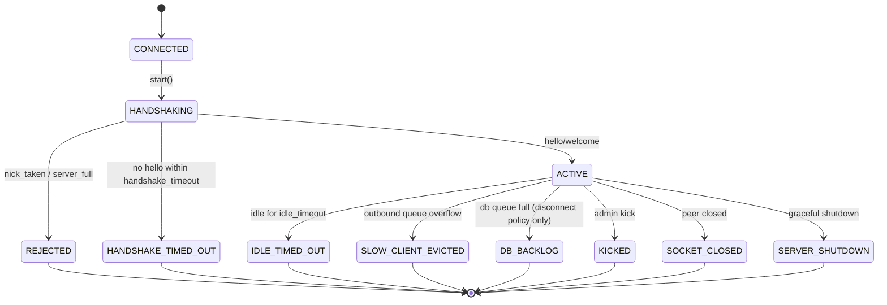

# Lifecycle



Connection states in code are terminal enums such as `ACTIVE`, `SERVER_SHUTDOWN`,
`KICKED`, `PROTOCOL_ERROR`, etc. The `CLOSING` / `CLOSED` labels are not used as
persistent states in this build.

Failure and eviction states:

```text
HANDSHAKING -> REJECTED
HANDSHAKING -> HANDSHAKE_TIMED_OUT   (never sent hello within handshake_timeout)
ACTIVE -> IDLE_TIMED_OUT             (now - max(last_seen, last_pong_at) >= idle_timeout)
ACTIVE -> SLOW_CLIENT_EVICTED        (slow_client error frame, then close)
ACTIVE -> DB_BACKLOG                 (only when db_backpressure_policy=disconnect)
ACTIVE -> KICKED                     (admin kick)
ACTIVE -> SOCKET_CLOSED
ACTIVE -> SERVER_SHUTDOWN            (graceful shutdown or in-flight server_shutting_down error)
ACTIVE -> PROTOCOL_ERROR               (non-recoverable framing violation)
```

While `stopping` is set, new client frames receive a non-recoverable
`server_shutting_down` error before the socket closes. Idle clients whose reader
exits on shutdown record `SERVER_SHUTDOWN` as the disconnect reason.

Rate limiting sends a recoverable `rate_limited` error frame; the session **stays**
`ACTIVE` (there is no persistent `RATE_LIMITED` connection state).

Under the default `reject_chat` DB backpressure policy, a full DB writer queue
returns `server_busy` and the client **remains connected** — only the
`disconnect` policy evicts with `DB_BACKLOG`.

Idle eviction uses `max(last_seen, last_pong_at)`: any received bytes refresh
`last_seen`; a matching `pong` for the outstanding `ping` refreshes
`last_pong_at`. Idle and handshake timeouts send a non-recoverable wire error
(`idle_timeout` / `handshake_timeout`) before the socket closes. Both enqueue a
`record_eviction` audit job when applicable.

Each terminal state is the exact reason recorded in the `record_disconnect`
audit row and the in-memory `recent_evictions` ring, so a kick is never logged
as a shutdown and a DB-backlog drop is never logged as a slow-client eviction.

Cleanup removes a session from:

- session registry
- nickname registry
- every room membership set
- outbound queue ownership
- socket ownership

Evictions (slow-client, idle-timeout, admin kick, DB-backlog) are counted in
stats and recorded in a bounded `recent_evictions` ring for diagnostics.

Server shutdown stops accepting, joins the accept thread, stops the scheduler,
notifies connected clients with a final `system` frame, closes sockets, drains
the DB writer queue, joins all workers, and clears live registries. Outbound
queues are **discarded** on shutdown — delivery is best-effort, and the shutdown
notice is sent directly rather than through the per-client queue. A clean
shutdown leaves no live `chatserver-*` threads (reader, writer, accept,
scheduler, db-writer, admin).

Joining a room automatically pushes a `history` frame (up to `history_limit`
messages) before the join system notice.
