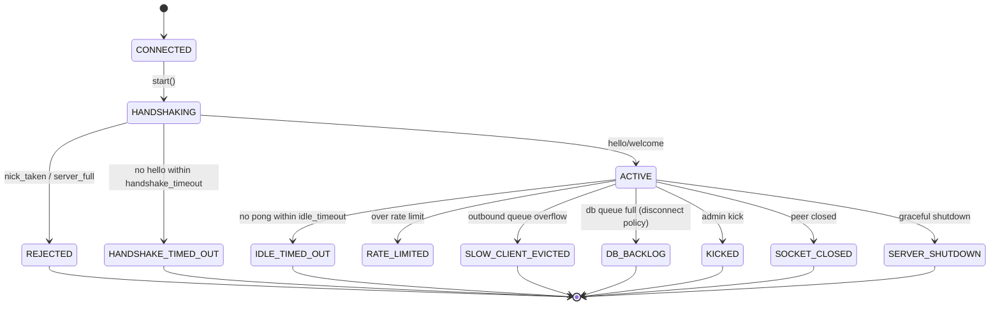

# Lifecycle



Connection states:

```text
CONNECTED -> HANDSHAKING -> ACTIVE -> CLOSING -> CLOSED
```

Failure and eviction states:

```text
HANDSHAKING -> REJECTED
HANDSHAKING -> HANDSHAKE_TIMED_OUT   (never sent hello within handshake_timeout)
ACTIVE -> IDLE_TIMED_OUT
ACTIVE -> RATE_LIMITED
ACTIVE -> SLOW_CLIENT_EVICTED
ACTIVE -> DB_BACKLOG          (rejected + disconnected under db_backpressure_policy=disconnect)
ACTIVE -> KICKED             (admin kick)
ACTIVE -> SOCKET_CLOSED
ACTIVE -> SERVER_SHUTDOWN
```

Each terminal state is the exact reason recorded in the `record_disconnect`
audit row and the in-memory `recent_evictions` ring, so a kick is never logged
as a shutdown and a DB-backlog drop is never logged as a slow-client eviction.

Cleanup removes a session from:

- session registry
- nickname registry
- every room membership set
- outbound queue ownership
- socket ownership

Evictions (slow-client, idle-timeout, admin kick, DB-backlog) are counted in
stats and recorded in a bounded `recent_evictions` ring for diagnostics.

Server shutdown stops accepting, notifies connected clients with a final
`system` frame, closes sockets, stops the scheduler, drains the DB writer queue,
joins all workers, and clears live registries. Outbound queues are **discarded**
on shutdown — delivery is best-effort, and the shutdown notice is sent directly
rather than through the per-client queue. A clean shutdown leaves no live
`chatserver-*` threads (reader, writer, accept, scheduler, db-writer, admin).
